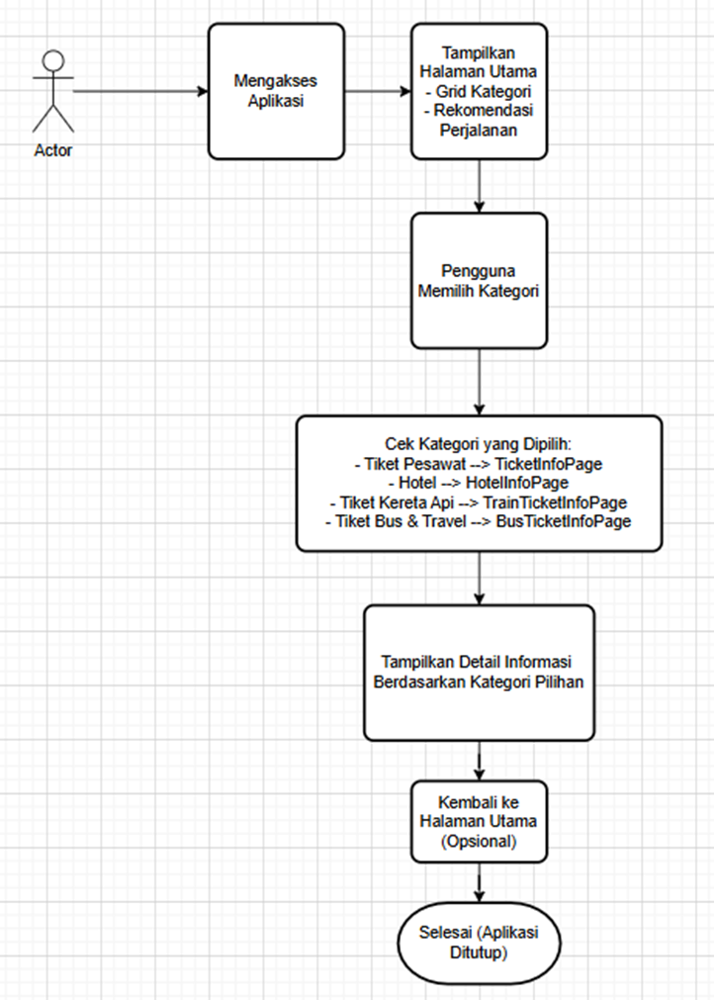

                        Mobile Apps Agen Travel

Bussines Domain : 
Mobile App Agen Travel

Business Process: Penyediaan Informasi Tiket

Introduction
Aplikasi Agen Travel adalah sebuah platform mobile yang menyediakan informasi terkait berbagai tiket perjalanan, seperti tiket pesawat, kereta api, bus, dan hotel. Dengan aplikasi ini, pengguna dapat mencari informasi harga, rute, dan jadwal perjalanan. Aplikasi ini hanya berfungsi sebagai platform informasi yang mempermudah pengguna untuk mencari informasi tiket dan perjalanan.

Objective
•	Dapat memperoleh informasi tiket dan perjalanan dengan mudah.
•	Mengetahui pilihan transportasi yang tersedia serta harga tiketnya.

Scope:

•	Aplikasi hanya memberikan informasi harga tiket dan rute perjalanan.

Batasan:

•	Aplikasi tidak menyediakan fitur pemesanan tiket atau transaksi pembayaran.

Criteria:
•	Pengguna dapat memperoleh informasi tiket hanya dengan menavigasi kategori yang tersedia

1.	Business Requirement Definition

    Definisi:
    Aplikasi Agen Travel adalah aplikasi mobile berbasis Flutter yang menyediakan informasi seputar kategori tiket perjalanan dan akomodasi. Pengguna dapat menavigasi berbagai kategori seperti tiket pesawat, kereta api, bus, dan hotel untuk melihat detail perjalanan, harga tiket, serta rekomendasi liburan. Aplikasi ini berfungsi sebagai sumber informasi wisata tanpa menyediakan fitur pemesanan atau pembayaran, sehingga memudahkan pengguna dalam menemukan opsi perjalanan terbaik sesuai kebutuhan mereka.

    Abstrak:

    Aplikasi Agen Travel bertujuan untuk menjadi solusi bagi para wisatawan dalam mencari informasi mengenai opsi transportasi dan akomodasi dengan mudah dan cepat. Menggunakan Flutter sebagai framework, aplikasi ini menawarkan antarmuka yang intuitif dan responsif, menampilkan berbagai kategori tiket dan rekomendasi perjalanan. Setiap kategori dapat diakses melalui grid interaktif, yang kemudian mengarahkan pengguna ke halaman informasi spesifik sesuai pilihan. Dengan menyediakan rekomendasi perjalanan serta detail harga tiket dan rute, aplikasi ini berfokus pada pengalaman pengguna yang mencari informasi wisata tanpa fitur transaksi, sehingga tetap ringan dan cepat.

2.	Penjelasan Fungsi
    1. Fungsi Teknis :
        1.	Grid Kategori

        •	Tiket Pesawat: Kategori ini digunakan untuk memesan tiket penerbangan. Pengguna dapat mencari, memilih, dan memesan tiket berdasarkan jadwal, maskapai, dan tujuan yang diinginkan.

        •	Hotel: Kategori ini untuk melakukan pemesanan kamar hotel. Pengguna dapat mencari hotel berdasarkan lokasi, tanggal menginap, jumlah tamu, dan preferensi lainnya, kemudian memesan kamar sesuai kebutuhan.

        •	Tiket Kereta Api: Pada kategori ini, pengguna dapat memesan tiket kereta api. Sistem akan menyediakan opsi berdasarkan jadwal kereta, kelas tempat duduk, dan rute yang diinginkan pengguna.

        •	Tiket Bus & Travel: Kategori ini menyediakan layanan pemesanan tiket bus dan perjalanan darat. Pengguna dapat mencari dan memesan tiket bus atau kendaraan travel sesuai rute dan jadwal yang tersedia.

        2.	Detail Perjalanan

            •	Pengguna dapat melihat detail seperti rute, harga, dan jadwal.

        3.	Pencarian Kategori

            •	Fitur pencarian mempermudah pengguna menemukan informasi berdasarkan kategori atau tujuan tertentu.

    2. Fungsi Strategis :
        1.	Kinerja:

        Memberikan solusi bagi pengguna yang memerlukan informasi perjalanan dengan cepat dan efisien.

        2.	Keunggulan:

        Antarmuka intuitif untuk pengalaman pengguna yang optimal.

3. Process Flows :

